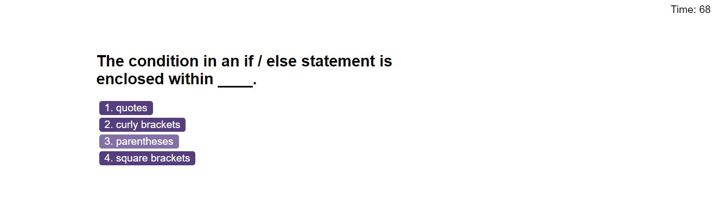

# 06-code-quiz

## Description

This repo contains all files related to the week 6 challenge. I was motivated to build the code quiz because I wanted to further practice applying JavaScript. The website allows users to test their JavaScript knowledge through a series of questions and provides instant feedback over their response. The user receives a score at the end of the quiz to show how well they have performed. I found this project challenging, but it enabled me to practice using event listeners, local storage and setting up a countdown using the set interval method.

## Installation

N/A

## Usage

This webpage has been set up to test coding knowledge of some of the key JavaScript concepts.

Please see below for a screenshot of the website.

Please refer to the link below to access the webpage:

[Code Quiz website](https://nwinch1512.github.io/06-code-quiz/ "Visit Code Quiz website")

## Credits

N/A

## License

Please refer to the LICENSE in the repo.
